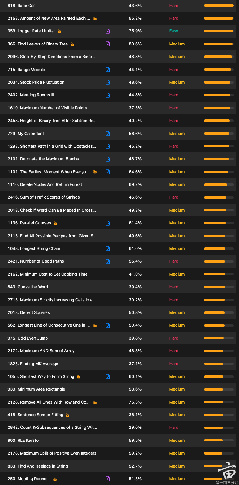
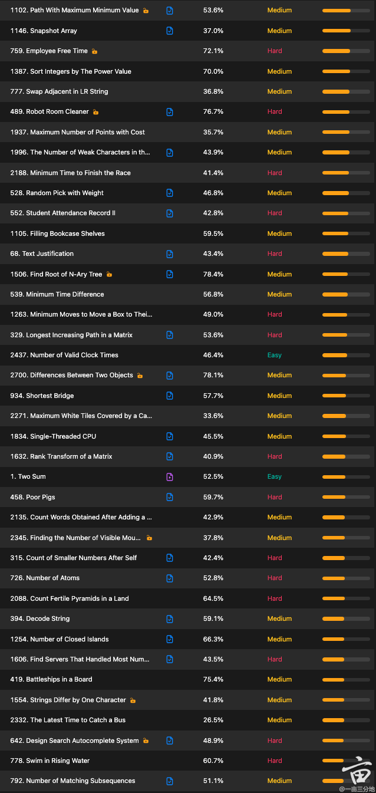
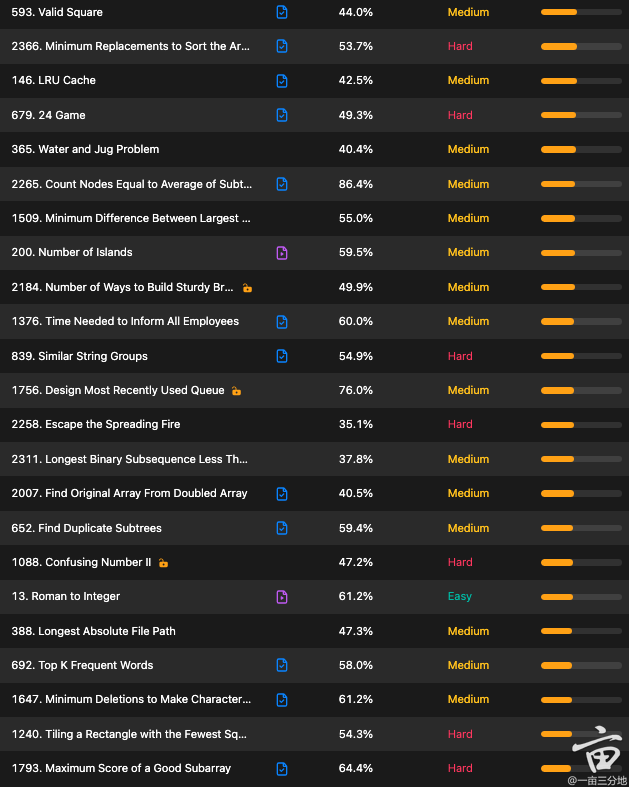

## Useful links:

- [Github Repo: LeetCode-Solutions](https://github.com/kamyu104/LeetCode-Solutions/tree/master){:, .purple}
- [Problem Description: leetcode.ca](https://leetcode.ca/search/){:, .purple}

## Top Frequent Problems
1. [818. Race Car](https://leetcode.com/problems/race-car/), [Solution](./818.%20Race%20Car.py){:, .orange}
2. [2158. Amount of New Area Painted Each Day](https://leetcode.ca/), [Solution](./2158.%20Amount%20of%20New%20Area%20Painted%20Each%20Day.py2021-10-27-2158-Amount-of-New-Area-Painted-Each-Day/){:, .orange}
3. [359. Logger Rate Limiter](https://leetcode.com/discuss/interview-question/340230/google-onsite-implement-logger/), [Solution](./359.%20Logger%20Rate%20Limiter.py){:, .orange}
4. [366. Find Leaves of Binary Tree](https://leetcode.com/problems/find-leaves-of-binary-tree/), [Solution](./366.%20Find%20Leaves%20of%20Binary%20Tree.py){:, .orange}
5. [2096. Step-By-Step Directions From A Binary Tree Node To Another](https://leetcode.com/problems/step-by-step-directions-from-a-binary-tree-node-to-another/), [Solution](./2096.%20Step-By-Step%20Directions%20From%20A%20Binary%20Tree%20Node%20To%20Another.py){:, .orange}
6. [715. Range Module](https://leetcode.com/problems/range-module/), [Solution](./715.%20Range%20Module.py){:. .orange}
7. [2034. Stock Price Fluctuation](https://leetcode.com/problems/stock-price-fluctuation/), [Solution](./2034.%20Stock%20Price%20Fluctuation.py){:, .orange}
8. [2402. Meeting Rooms III](https://leetcode.com/problems/meeting-rooms-iii/), [Solution](./2402.%20Meeting%20Rooms%20III.py){:, .orange}
9. [1610. Maximum Number of Visible Points](https://leetcode.com/problems/maximum-number-of-visible-points/), [Solution](./1610.%20Maximum%20Number%20of%20Visible%20Points.py){:, .orange}
10. [2458. Height of Binary Tree After Subtree Removal Queries](https://leetcode.com/problems/height-of-binary-tree-after-subtree-removal-queries/), [Solution](./2458.%20Height%20of%20Binary%20Tree%20After%20Subtree%20Removal%20Queries.py){:, .orange}
11. [729. My Calendar I](https://leetcode.com/problems/my-calendar-i/), [Solution](./729.%20My%20Calendar%20I.py){:, .orange}
12. [1293. Shortest Path in a Grid with Obstacles Elimination](https://leetcode.com/problems/shortest-path-in-a-grid-with-obstacles-elimination/), [Solution](./1293.%20Shortest%20Path%20in%20a%20Grid%20with%20Obstacles%20Elimination.PY){:, .orange}
13. [2101. Detonate the Maximum Bombs](https://leetcode.com/problems/detonate-the-maximum-bombs/), [Solution](./2101.%20Detonate%20the%20Maximum%20Bombs.PY){:, .orange}
14. [1101. The Earliest Moment When Everyone Become Friends](https://leetcode.com/problems/the-earliest-moment-when-everyone-become-friends/), [Solution]
15. [1110. Delete Nodes And Return Forest](https://leetcode.com/problems/delete-nodes-and-return-forest/), [Solution]
16. [2416. Sum of Prefix Scores of Strings](https://leetcode.com/problems/sum-of-prefix-scores-of-strings/), [Solution]
17. [2018. Check if Word Can Be Placed In Crossword](https://leetcode.com/problems/check-if-word-can-be-placed-in-crossword/), [Solution]
18. [1136. Parallel Courses](https://leetcode.com/problems/parallel-courses/)
19. [2115. Find All Possible Recipes from Given Supplies](https://leetcode.com/problems/find-all-possible-recipes-from-given-supplies/), [Solution]
20. [1048. Longest String Chain](https://leetcode.com/problems/longest-string-chain/), [Solution]
21. [2421. Number of Good Paths](https://leetcode.com/problems/number-of-good-paths/), [Solution]
22. [2162. Minimum Cost to Set Cooking Time](https://leetcode.com/problems/minimum-cost-to-set-cooking-time/), [Solution]
23. [843. Guess the Word](https://leetcode.com/problems/guess-the-word/)
24. [2713. Maximum Strictly Increasing Cells in a Matrix](https://leetcode.com/problems/maximum-strictly-increasing-cells-in-a-matrix/), [Solution]
25. [2013. Detect Squares](https://leetcode.com/problems/detect-squares/)
26. [562. Longest Line of Consecutive One in Matrix](https://leetcode.com/problems/longest-line-of-consecutive-one-in-matrix/), [Solution]
27. [975. Odd Even Jump](https://leetcode.com/problems/odd-even-jump/), [Solution]
28. [2172. Maximum AND Sum of Array](https://leetcode.com/problems/maximum-and-sum-of-array/), [Solution]
29. [1825. Finding MK Average](https://leetcode.com/problems/finding-mk-average/), [Solution]
30. [1055. Shortest Way to Form String](https://leetcode.com/problems/shortest-way-to-form-string/), [Solution]
31. [939. Minimum Area Rectangle](https://leetcode.com/problems/minimum-area-rectangle/), [Solution]
32. [2128. Remove All Ones With Row and Column Flips](https://leetcode.com/problems/remove-all-ones-with-row-and-column-flips/), [Solution]
33. [418. Sentence Screen Fitting](https://leetcode.com/problems/sentence-screen-fitting/), [Solution]
34. [2842. Count K-Subsequences of a String With Maximum Beauty](https://leetcode.com/problems/count-k-subsequences-of-a-string-with-maximum-beauty/), [Solution]
35. [900. RLE Iterator](https://leetcode.com/problems/rle-iterator/), [Solution]
36. [2178. Maximum Split of Positive Even Integers](https://leetcode.com/problems/maximum-split-of-positive-even-integers/)
37. [833. Find And Replace in String](https://leetcode.com/problems/find-and-replace-in-string/)
38. [253. Meeting Rooms II](https://leetcode.com/problems/meeting-rooms-ii/), [Solution]
39. [1102. Path With Maximum Minimum Value](https://leetcode.com/problems/path-with-maximum-minimum-value/), [Solution]
40. [1146. Snapshot Array](https://leetcode.com/problems/snapshot-array/), [Solution]
41. [759. Employee Free Time](https://leetcode.com/problems/employee-free-time/), [Solution]
42. [1387. Sort Integers by The Power Value](https://leetcode.com/problems/sort-integers-by-the-power-value/), [Solution]
43. [777. Swap Adjacent in LR String](https://leetcode.com/problems/swap-adjacent-in-lr-string/), [Solution]
44. [489. Robot Room Cleaner](https://leetcode.com/problems/robot-room-cleaner/), [Solution]
45. [1937. Maximum Number of Points with Cost](https://leetcode.com/problems/maximum-number-of-points-with-cost/), [Solution]
46. [1996. The Number of Weak Characters in the Game](https://leetcode.com/problems/the-number-of-weak-characters-in-the-game/), [Solution]
47. [2188. Minimum Time to Finish the Race](https://leetcode.com/problems/minimum-time-to-finish-the-race/), [Solution]
48. [528. Random Pick with Weight](https://leetcode.com/problems/random-pick-with-weight/), [Solution]
49. [552. Student Attendance Record II](https://leetcode.com/problems/student-attendance-record-ii/), [Solution]
50. [1105. Filling Bookcase Shelves](https://leetcode.com/problems/filling-bookcase-shelves/), [Solution]
51. [68. Text Justification](https://leetcode.com/problems/text-justification/), [Solution]
52. [1506. Find Root of N-Ary Tree](https://leetcode.com/problems/find-root-of-n-ary-tree/), [Solution]
53. [539. Minimum Time Difference](https://leetcode.com/problems/minimum-time-difference/), [Solution]
54. [1263. Minimum Moves to Move a Box to Their Target Location](https://leetcode.com/problems/minimum-moves-to-move-a-box-to-their-target-location/), [Solution]
55. [329. Longest Increasing Path in a Matrix](https://leetcode.com/problems/longest-increasing-path-in-a-matrix/), [Solution]
56. [2437. Number of Valid Clock Times](https://leetcode.com/problems/number-of-valid-clock-times/), [Solution]
57. [2700. Differences Between Two Objects](https://leetcode.com/problems/differences-between-two-objects/), [Solution]
58. [934. Shortest Bridge](https://leetcode.com/problems/shortest-bridge/), [Solution]
59. [2271. Maximum White Tiles Covered by a Carpet](https://leetcode.com/problems/maximum-white-tiles-covered-by-a-carpet/), [Solution]
60. [1834. Single-Threaded CPU](https://leetcode.com/problems/single-threaded-cpu/), [Solution]
61. [1632. Rank Transform of a Matrix](https://leetcode.com/problems/rank-transform-of-a-matrix/), [Solution]
62. [1. Two Sum](https://leetcode.com/problems/two-sum/), [Solution]
63. [458. Poor Pigs](https://leetcode.com/problems/poor-pigs/), [Solution]
64. [2135. Count Words Obtained After Adding a Letter](https://leetcode.com/problems/count-words-obtained-after-adding-a-letter/), [Solution]
65. [2345. Finding the Number of Visible Mountains](https://leetcode.com/problems/finding-the-number-of-visible-mountains/), [Solution]
66. [315. Count of Smaller Numbers After Self](https://leetcode.com/problems/count-of-smaller-numbers-after-self/), [Solution]
67. [726. Number of Atoms](https://leetcode.com/problems/number-of-atoms/), [Solution]
68. [2088. Count Fertile Pyramids in a Land](https://leetcode.com/problems/count-fertile-pyramids-in-a-land/), [Solution]
69. [394. Decode String](https://leetcode.com/problems/decode-string/), [Solution]
70. [1254. Number of Closed Islands](https://leetcode.com/problems/number-of-closed-islands/), [Solution]
71. [1606. Find Servers That Handled Most Number of Requests](https://leetcode.com/problems/find-servers-that-handled-most-number-of-requests/), [Solution]
72. [419. Battleships in a Board](https://leetcode.com/problems/battleships-in-a-board/), [Solution]
73. [1554. Strings Differ by One Character](https://leetcode.com/problems/strings-differ-by-one-character/), [Solution]
74. [2332. The Latest Time to Catch a Bus](https://leetcode.com/problems/the-latest-time-to-catch-a-bus/), [Solution]
75. [642. Design Search Autocomplete System](https://leetcode.com/problems/design-search-autocomplete-system/), [Solution]
76. [778. Swim in Rising Water](https://leetcode.com/problems/swim-in-rising-water/), [Solution]
77. [792. Number of Matching Subsequences](https://leetcode.com/problems/number-of-matching-subsequences/), [Solution]
78. [593. Valid Square](https://leetcode.com/problems/valid-square/), [Solution]
79. [2366. Minimum Replacements to Sort the Array](https://leetcode.com/problems/minimum-replacements-to-sort-the-array/), [Solution]
80. [146. LRU Cache](https://leetcode.com/problems/lru-cache/), [Solution]
81. [679. 24 Game](https://leetcode.com/problems/24-game/), [Solution]
82. [365. Water and Jug Problem](https://leetcode.com/problems/water-and-jug-problem/), [Solution]
83. [2266. Count Nodes Equal to Average of Subtree](https://leetcode.com/problems/count-nodes-equal-to-average-of-subtree/), [Solution]
84. [1509. Minimum Difference Between Largest and Smallest Value in Three Moves](https://leetcode.com/problems/minimum-difference-between-largest-and-smallest-value-in-three-moves/), [Solution]
85. [200. Number of Islands](https://leetcode.com/problems/number-of-islands/), [Solution]
86. [2184. Number of Ways to Build Sturdy Brick Wall](https://leetcode.com/problems/number-of-ways-to-build-sturdy-brick-wall/), [Solution]
87. [1376. Time Needed to Inform All Employees](https://leetcode.com/problems/time-needed-to-inform-all-employees/), [Solution]
88. [839. Similar String Groups](https://leetcode.com/problems/similar-string-groups/), [Solution]
89. [1756. Design Most Recently Used Queue](https://leetcode.com/problems/design-most-recently-used-queue/), [Solution]
90. [2258. Escape the Spreading Fire](https://leetcode.com/problems/escape-the-spreading-fire/), [Solution]
91. [2311. Longest Binary Subsequence Less Than or Equal to K](https://leetcode.com/problems/longest-binary-subsequence-less-than-or-equal-to-k/), [Solution]
92. [2007. Find Original Array From Doubled Array](https://leetcode.com/problems/find-original-array-from-doubled-array/), [Solution]
93. [652. Find Duplicate Subtrees](https://leetcode.com/problems/find-duplicate-subtrees/), [Solution]
94. [1088. Confusing Number II](https://leetcode.com/problems/confusing-number-ii/), [Solution]
95. [13. Roman to Integer](https://leetcode.com/problems/roman-to-integer/), [Solution]
96. [388. Longest Absolute File Path](https://leetcode.com/problems/longest-absolute-file-path/), [Solution]
97. [692. Top K Frequent Words](https://leetcode.com/problems/top-k-frequent-words/), [Solution]
98. [1647. Minimum Deletions to Make Character Frequencies Unique](https://leetcode.com/problems/minimum-deletions-to-make-character-frequencies-unique/), [Solution]
99. [1240. Tiling a Rectangle with the Fewest Squares](https://leetcode.com/problems/tiling-a-rectangle-with-the-fewest-squares/), [Solution]
100. [1793. Maximum Score of a Good Subarray](https://leetcode.com/problems/maximum-score-of-a-good-subarray/), [Solution]

